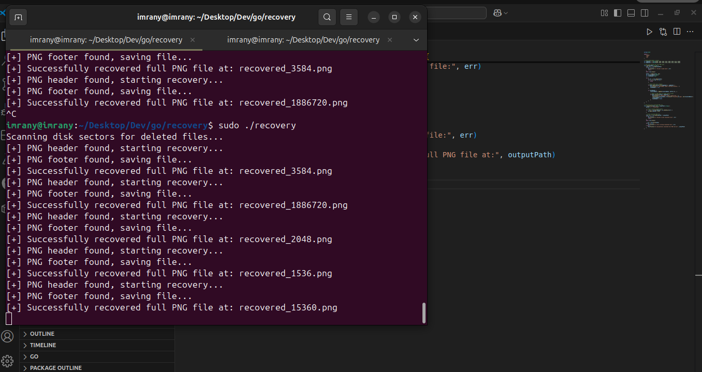

# 🛠️ Disk Recovery Tool

A simple tool to scan your disk for deleted files and recover them easily.

<!-- --- -->

## 🖼️ Screenshot

  
*Example: Recovering deleted files from a disk.*

<!-- --- -->

## 📖 Overview

**Disk Recovery Tool** helps you restore deleted files from your hard drive or USB stick.  
It scans disk sectors for lost files and recovers them based on file signatures.

- **Who is it for?**  
    Anyone who accidentally deleted files and wants to get them back.

- **Tech Stack:**  
    - Go (Golang)

<!-- --- -->

## 🚀 How to Use

### 1. Download & Install

- Download the latest release from [Releases](https://github.com/imrany/recovery/releases).
- Extract the archive and open a terminal in that folder.

### 2. Recover Your Files

- **To recover specific file types:**  
    ```sh
    ./recovery -disk=<diskpath> -type=jpg
    ```
- **To recover all files:**  
    ```sh
    ./recovery -disk=<diskpath> -type=all
    ```
- **List partitions:**  
    ```sh
    ./recovery -disk=<diskpath> -partitions
    ```
- **Check file metadata:**  
    ```sh
    ./recovery -info=<file_path>
    ```

> **Note:**  
> Recovered files are saved in `./recovered/recovered_<sector>.<ext>`

---

## 🛠️ Developer Setup

1. Clone the repo:
     ```sh
     git clone https://github.com/imrany/recovery.git
     cd recovery
     ```
2.  Install go packages
    ```sh
    go mod tidy
    ```
3. Build the tool:
     ```sh
     go build -o recovery
     ```
4. Run as shown above.

<!-- --- -->

## 🐛 Known Issues

- May not recover all file types.
- Some files may be partially corrupted.
- Requires admin/root permissions to access disks.

<!-- --- -->

## ℹ️ Extra Info

- **License:**  
    BSD 3-Clause License

- **Resources:**  
    - [Go Documentation](https://golang.org/doc/)
    - [File Recovery Concepts](https://en.wikipedia.org/wiki/Data_recovery)

- **Contact:**  
    [imranmat254@gmail.com](mailto:imranmat254@gmail.com)

- **Buy me a coffee:**  
    [☕ Support me](https://github.com/sponsors/imrany)
